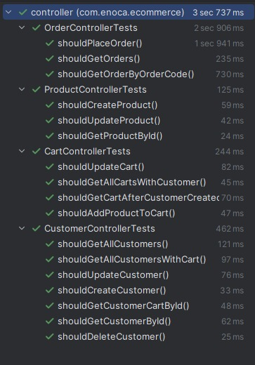

# Ecommerce API - Enoca Assigment


[##**Answers of Assigment Questions**##](https://github.com/Eukolos/assignment-enoca/blob/main/ANSWER.md)

# Uygulamayı bu [LINK](http://18.184.3.87:8080/api/v1/swagger-ui/index.html) üzerinden online test edebilirsiniz.
### You can test the application online with this [LINK](http://18.184.3.87:8080/api/v1/swagger-ui/index.html) with Swagger UI

## Uygulamanın databaseini [LINK](http://18.184.3.87:5050) üzerinden görebilirsiniz. 
### You can see the database of the application on this [LINK](http://18.184.3.87:5050) with PG Admin 4
  - Username: admin@admin.com
  - Password: admin

## Table of Contents

- [Dependencies Used](#dependencies-used)
- [Run the App](#🔨-run-the-app)
- [Answer of Assigment Questions](https://github.com/Eukolos/assignment-enoca/blob/main/ANSWER.md)
- [Tree of Layered Structure](#tree-of-layered-structure)
- [Testing](#testing)
- [Contact](#contact)


## Dependencies Used for Backend
- [Spring Framework](https://docs.spring.io/spring-framework/docs/current/reference/html/)
    - [Spring Boot](https://spring.io/projects/spring-boot)
    - [Spring Web](https://docs.spring.io/spring-framework/docs/3.2.x/spring-framework-reference/html/mvc.html)
    - [Spring JPA](https://spring.io/projects/spring-data-jpa)
    - [Spring Validation](https://docs.spring.io/spring-framework/docs/4.1.x/spring-framework-reference/html/validation.html)
    - [Spring Actuator](https://spring.io/guides/gs/actuator-service)
    - [Spring Test](https://docs.spring.io/spring-boot/docs/1.5.2.RELEASE/reference/html/boot-features-testing.html)
    - [TestContainer](https://testcontainers.com/)
    - [Rest Assured](https://rest-assured.io/)
    - [Lombok](https://projectlombok.org/)
    - [Swagger](https://springdoc.org//)
    - [H2 Database](https://www.h2database.com/html/main.html)
- [Postgresql](https://www.postgresql.org/)
- [PG Admin 4](https://www.pgadmin.org/docs/)
- [Java JDK 17](https://docs.oracle.com/en/java/javase/17/docs/api/index.html)
- [Maven](https://maven.apache.org/)

## Dependencies Used for Devops
- [Docker](https://www.docker.com/)
- [Docker Compose](https://docs.docker.com/compose/)
- [Git](https://git-scm.com/)
- [Github Actions](https://docs.github.com/en/actions)
- [AWS EC2](https://aws.amazon.com/ec2/)
- [AWS Linux 2](https://aws.amazon.com/amazon-linux-2/)
- [Fail2Ban](https://www.fail2ban.org/wiki/index.php/Main_Page)
- [HoneyPot](https://www.honeynet.org/)
- [Nginx](https://www.nginx.com/)
- [SSL](https://www.ssl.com/)


## #🔨 Run the App

#### Maven & Docker

<b>1 )</b> Download your project from this link shown below
```
    git clone https://github.com/Eukolos/assignment-enoca.git
```

<b>2 )</b> Go to the project's home directory shown below
```
    cd assignment-enoca
```
<b>4 )</b> Run the project's db and db ui though this command shown below
```
    docker-compose up
```

<b>3 )</b> Start the project
```
    mvn spring-boot:start
```

## Testing

The project is thoroughly tested to ensure code quality and reliability.

### Integration Tests

Integration tests have been implemented using [JUnit](https://junit.org/) with [TestContainers](https://www.testcontainers.org/) for the database and [Rest Assured](https://rest-assured.io/) for API endpoints. The integration test files are located in the `src/test/java` directory.



### Test Coverage

[**All my tests and coverage percent in here**](https://raw.githack.com/Eukolos/assignment-enoca/main/htmlReport/index.html)

## We can test app online with this [LINK](http://18.184.3.87:8080/api/v1/swagger-ui/index.html) with Swagger UI

## #Tree of Layered Structure

```txt
.
src
├── controller
│   ├── OrderController.java class
│   ├── CustomerController.java class
│   ├── CartController.java class
│   └── ProductController.java class
├── dto
│   ├── AddProductRequest.java record
│   ├── CartCustomerDto.java record
│   ├── CartDto.java record
│   ├── CustomerCartDto.java record
│   ├── CustomerDto.java record
│   ├── OrderDto.java record
│   ├── ProductDto.java record
│   ├── ProductHolderDto.java record
│   └── UpdateCartRequest.java record
├── entity
│   ├── BaseEntity.java abstract class
│   ├── Customer.java class
│   ├── Product.java class
│   ├── ProductHolder.java class
│   ├── Order.java class
│   └── Cart.java class
├── exception
│   ├── ErrorDetails.java record
│   └── GeneralExceptionAdvice.java class
├── repository
│   ├── CustomerRepository.java interface
│   ├── ProductRepository.java interface
│   ├── ProductHolderRepository.java interface
│   ├── CartRepository.java interface
│   └── OrderRepository.java interface
├── service
│   ├── CustomerService.java class
│   ├── CartService.java class
│   ├── OrderService.java class
│   ├── ProductService.java class
│   └── ProductHolderService.java class
│  
└── EcommerceApplication.java class
test
│
├── controller
│   ├── CartControllerTests.java class
│   ├── OrderControllerTests.java class
│   ├── ProductControllerTests.java class
│   └── CustomerControllerTests.java class
├── AbstractIntegrationTest.java abstract class
├── EcommerceApplicationTests.java class
├── TestcontainersConfiguration.java class
└── TestEcommerceApplication.java class
  
```


## Contact

This project was created by [Eukolos](https://github.com/Eukolos). Contributions are welcome!
 ct maintainer at eminaksoy35@gmail.com.

